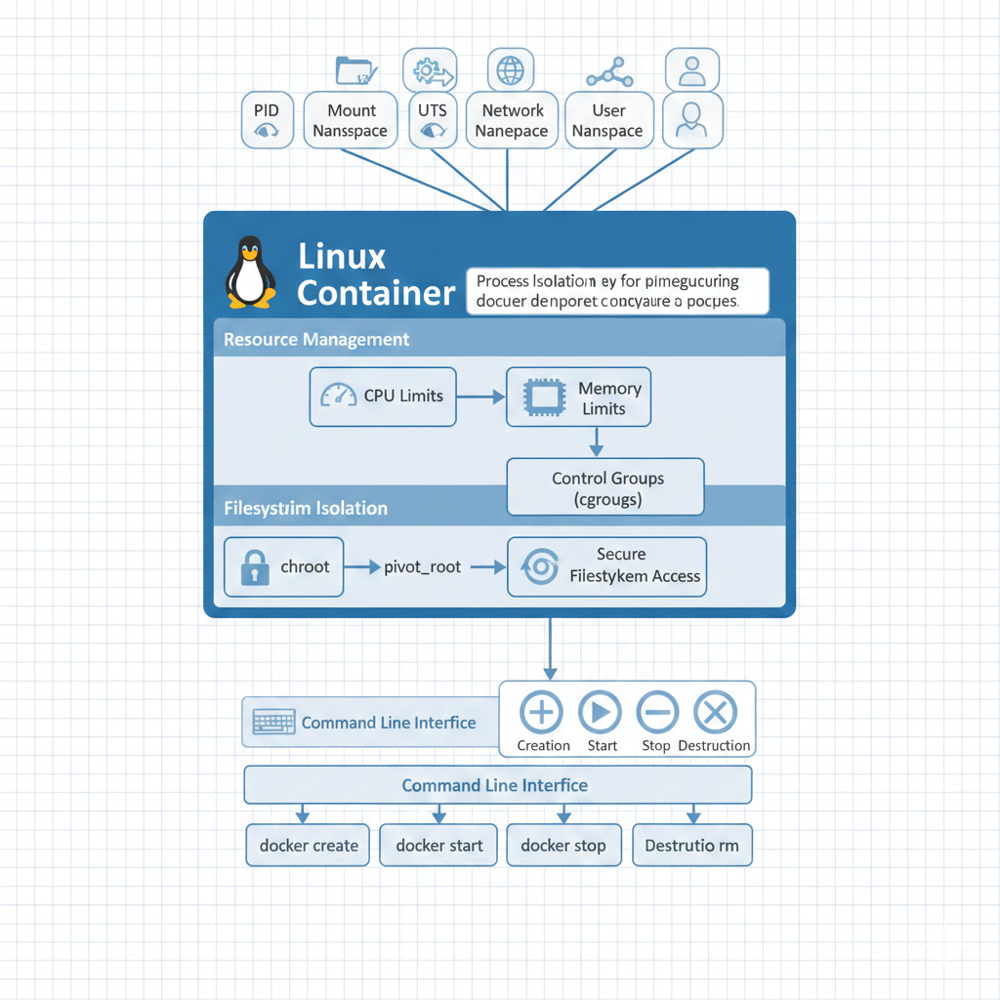

<div style="display: flex; align-items: flex-start; margin-bottom: 30px;">
  
  <div>
    <h1>Mini Container</h1>
    <p>
      این پروژه پیاده‌سازی سبک‌وزن کانتینرها با استفاده از <strong>Linux namespaces</strong>، <strong>cgroups</strong> و <strong>filesystem isolation</strong> است.
      هدف آن نمایش مفاهیم اصلی سیستم‌عامل شامل <strong>ایزولاسیون فرایند</strong>، <strong>مدیریت منابع</strong> و <strong>امنیت فایل‌سیستم</strong> است.
    </p>
  </div>
</div>

<div style="display: flex; align-items: flex-start; margin-bottom: 30px;">
  
  <div>
    <h2>ویژگی‌های کلیدی</h2>
    <ul style="line-height: 1.6;">
      <li><strong>ایزولاسیون فرایند</strong>: از فضای نام لینوکس استفاده می‌کند (PID, mount, UTS, network, user)</li>
      <li><strong>مدیریت منابع</strong>: محدودیت‌های CPU و حافظه از طریق گروه‌های کنترل (cgroups)</li>
      <li><strong>ایزولاسیون فایل‌سیستم</strong>: chroot برای دسترسی امن فایل‌سیستم</li>
      <li><strong>چرخه حیات کانتینر</strong>: عملیات ایجاد، شروع، توقف و نابودی کانتینر</li>
      <li><strong>رابط خط فرمان</strong>: ابزارهای CLI و منوی گرافیکی برای مدیریت کانتینر</li>
    </ul>
  </div>
</div>

<h2>پیش‌نیازها</h2>
<ul style="line-height: 1.6;">
  <li><strong>هسته لینوکس</strong>: ۳.۸+ (برای پشتیبانی فضای نام)</li>
  <li><strong>کامپایلر C++</strong>: GCC (g++) با پشتیبانی C++11</li>
  <li><strong>دسترسی root</strong>: برای عملیات کانتینر ضروری است</li>
  <li><strong>سی‌گروپ‌ها (Cgroups)</strong>: mount شده در <code>/sys/fs/cgroup</code></li>
  <li><strong>Docker و Docker Compose</strong>: Docker 20.10+ و Compose 1.29+</li>
  <li><strong>امتیازات sudo</strong>: برای اجرای کانتینرهای privileged</li>
</ul>

<h2>نصب و اجرای پروژه</h2>

### ساخت فایل‌های پروژه
```bash
git clone https://github.com/mroraie/mini-container.git
cd mini-container
make
make ui
````

### اجرای اسکریپت‌های آماده

```bash
./deploy.sh
./deploy-dev.sh
```

### استفاده

#### رابط گرافیکی ترمینال

```bash
./mini-container-ui
```

#### دستورات پایه (CLI)

```bash
./mini-container run /bin/echo "Hello World"
./mini-container run --memory 128 --cpu 512 /bin/sh
./mini-container list
./mini-container info container_id
./mini-container stop container_id
./mini-container destroy container_id
```


<h2>مفاهیم سیستم‌عامل نشان داده شده</h2>

### ۱. فضای نام لینوکس
* <strong>PID</strong>: ایزولاسیون شناسه فرایند
* <strong>Mount</strong>: ایزولاسیون فایل‌سیستم
* <strong>UTS</strong>: ایزولاسیون نام میزبان
* <strong>Network</strong>: ایزولاسیون پشته شبکه
* <strong>User</strong>: ایزولاسیون شناسه کاربر/گروه

### ۲. گروه‌های کنترل (cgroups)

* کنترل CPU: مدیریت زمان‌بندی و سهمیه
* کنترل حافظه: محدودیت‌های RAM و swap

### ۳. امنیت فایل‌سیستم

* chroot: تغییر دایرکتوری ریشه
* فضای نام Mount: جداول mount خصوصی

### ۴. فراخوانی‌های سیستمی

* clone()، unshare()، mount()، chroot()

<!-- =================== ساختار پروژه =================== -->

<h2>ساختار پروژه</h2>
<pre style="background:#f4f4f4; padding:10px; border-radius:6px;">
mini-container/
├── src/                     # کد منبع
├── include/                 # فایل‌های سرآیند
├── tests/                   # اسکریپت‌های تست
├── examples/                # مثال‌های استفاده
├── docs/                    # مستندات
├── Dockerfile               # تنظیمات Docker
├── docker-compose.yml       # تنظیمات Docker Compose
├── deploy.sh                # اسکریپت استقرار
├── deploy-dev.sh            # اسکریپت توسعه
└── Makefile                 # سیستم ساخت
</pre>

<!-- =================== تست‌ها =================== -->

<h2>تست‌ها</h2>
<p>تست‌های عملکرد و ایزولاسیون کانتینرها شامل مصرف CPU، حافظه و ترکیبی از آن‌ها هستند.</p>

### مثال: CPU Usage Test

```bash
while true; do :; done   # حلقه بی‌نهایت برای تست CPU
```

### مثال: Memory Limit Test

```bash
dd if=/dev/zero of=/tmp/mem bs=1M count=80  # تست محدودیت حافظه
```

### اجرای همه تست‌ها

```bash
sudo ./mini-container
# گزینه 7: Run Tests
```

<!-- =================== مقایسه با Docker =================== -->

<h2>مقایسه با Docker</h2>
<table style="border-collapse: collapse; width: 100%;">
  <thead>
    <tr>
      <th style="border: 1px solid #ddd; padding: 8px;">ویژگی</th>
      <th style="border: 1px solid #ddd; padding: 8px;">مینی کانتینر</th>
      <th style="border: 1px solid #ddd; padding: 8px;">Docker</th>
    </tr>
  </thead>
  <tbody>
    <tr>
      <td style="border: 1px solid #ddd; padding: 8px;">ایزولاسیون</td>
      <td style="border: 1px solid #ddd; padding: 8px;">فضای نام هسته</td>
      <td style="border: 1px solid #ddd; padding: 8px;">فضای نام + لایه‌های اضافی</td>
    </tr>
    <tr>
      <td style="border: 1px solid #ddd; padding: 8px;">مدیریت منابع</td>
      <td style="border: 1px solid #ddd; padding: 8px;">cgroups</td>
      <td style="border: 1px solid #ddd; padding: 8px;">cgroups + کنترل‌های اضافی</td>
    </tr>
    <tr>
      <td style="border: 1px solid #ddd; padding: 8px;">فایل‌سیستم</td>
      <td style="border: 1px solid #ddd; padding: 8px;">chroot/pivot_root</td>
      <td style="border: 1px solid #ddd; padding: 8px;">فایل‌سیستم لایه‌ای + overlay</td>
    </tr>
    <tr>
      <td style="border: 1px solid #ddd; padding: 8px;">شبکه</td>
      <td style="border: 1px solid #ddd; padding: 8px;">فضای نام پایه</td>
      <td style="border: 1px solid #ddd; padding: 8px;">شبکه پیشرفته</td>
    </tr>
    <tr>
      <td style="border: 1px solid #ddd; padding: 8px;">ایمیج‌ها</td>
      <td style="border: 1px solid #ddd; padding: 8px;">تنظیم دستی</td>
      <td style="border: 1px solid #ddd; padding: 8px;">لایه‌های ایمیج + registry</td>
    </tr>
    <tr>
      <td style="border: 1px solid #ddd; padding: 8px;">پیچیدگی</td>
      <td style="border: 1px solid #ddd; padding: 8px;">حداقل</td>
      <td style="border: 1px solid #ddd; padding: 8px;">ویژگی کامل</td>
    </tr>
  </tbody>
</table>
```

---

این نسخه:

* **تمام تصاویر کنار متن هستند** و فاصله/سایه دارند
* **لیست‌ها خوانا و فاصله‌دار** شده‌اند
* **کدها قالب‌بندی شده با `bash` یا `pre`**
* **جدول مقایسه مرتب و خوانا**
* ظاهر **حرفه‌ای برای GitHub و VSCode**

