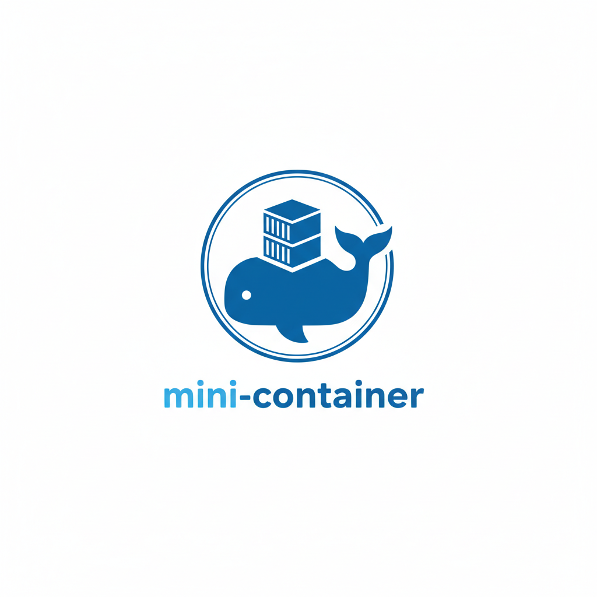

# سیستم مینی کانتینر



پیاده‌سازی سبک کانتینر که مفاهیم اصلی سیستم‌عامل را نشان می‌دهد شامل ایزولاسیون فرایند، مدیریت منابع و امنیت فایل‌سیستم.

## نمای کلی

این پروژه سیستم مینی کانتینر مشابه داکر را پیاده‌سازی می‌کند که به عنوان پروژه درس سیستم‌عامل طراحی شده است. بر خلاف داکر، این سیستم به طور مستقیم با مکانیزم‌های هسته لینوکس تعامل می‌کند و از فراخوانی‌های سیستمی و رابط‌های هسته استفاده می‌کند.

## ویژگی‌های کلیدی

- **ایزولاسیون فرایند**: از فضای نام لینوکس استفاده می‌کند (PID, mount, UTS)
- **مدیریت منابع**: محدودیت‌های CPU و حافظه از طریق گروه‌های کنترل (cgroups)
- **ایزولاسیون فایل‌سیستم**: chroot برای دسترسی امن فایل‌سیستم
- **چرخه حیات کانتینر**: عملیات ایجاد، شروع، توقف و نابودی کانتینر
- **رابط خط فرمان**: ابزارهای خط فرمان برای مدیریت کانتینر

## معماری

```
┌─────────────────┐
│ رابط خط فرمان   │
└─────────┬───────┘
          │
┌─────────▼────────┐
│مدیریت‌کننده     │
│   کانتینر       │
├─────────┬────────┤
│مدیریت   │ مدیریت│
│منابع    │ فایل   │
│         │ سیستم │
├─────────┼────────┤
│ مدیریت  │        │
│فضای نام │        │
└─────────┴────────┘
```

## پیش‌نیازها

### پیش‌نیازهای محلی

- **هسته لینوکس**: ۳.۸+ (برای پشتیبانی فضای نام)
- **کامپایلر سی‌پلاس‌پلاس**: GCC (g++) یا سازگار با پشتیبانی C++11
- **دسترسی روت**: برای عملیات کانتینر ضروری است
- **Cgroups**: در `/sys/fs/cgroup` mount شده
  - **پشتیبانی از Cgroup v2**: سیستم به صورت خودکار cgroup v2 و v1 را تشخیص می‌دهد
  - برای اطلاعات بیشتر به [CGROUP_V2_SUPPORT.md](CGROUP_V2_SUPPORT.md) مراجعه کنید

### پیش‌نیازهای Docker (برای VPS)

- **Docker**: ۲۰.۱۰+
- **Docker Compose**: ۱.۲۹+
- **سیستم عامل**: لینوکس با هسته ۳.۸+
- **امتیازات sudo**: برای اجرای کانتینرهای privileged

#### نصب Docker روی VPS

**Ubuntu/Debian:**
```bash
sudo apt update
sudo apt install -y docker.io docker-compose
sudo systemctl start docker
sudo systemctl enable docker
sudo usermod -aG docker $USER
```

**CentOS/RHEL:**
```bash
sudo yum install -y docker docker-compose
sudo systemctl start docker
sudo systemctl enable docker
sudo usermod -aG docker $USER
```

**با Docker Desktop:**
```bash
# دانلود و نصب از https://docker.com
```

## ساخت

### ساخت محلی

```bash
# Clone یا به دایرکتوری پروژه بروید
cd mini-container

# سیستم را بسازید
make

# یا برای ساخت رابط گرافیکی ترمینال:
make ui

# اختیاری: نصب در کل سیستم
sudo make install
```

### استقرار با Docker (توصیه شده برای VPS)

```bash
# Clone کردن پروژه
git clone https://github.com/mroraie/mini-container.git
cd mini-container

# اجرای اسکریپت استقرار خودکار
./deploy.sh

# یا برای محیط توسعه (با mount کردن فایل‌ها)
./deploy-dev.sh
```

#### دستورات Docker دستی

```bash
# ساخت و اجرای کانتینر
docker-compose up --build

# اجرای در پس‌زمینه
docker-compose up --build -d

# اتصال به کانتینر در حال اجرا
docker-compose exec mini-container bash

# مشاهده لاگ‌ها
docker-compose logs -f

# متوقف کردن کانتینر
docker-compose down
```

## استفاده

### رابط گرافیکی وب (GUI)

برای تجربه کاربری بهتر، از رابط گرافیکی وب استفاده کنید:

```bash
# ساخت GUI
make ui

# اجرای رابط گرافیکی وب
./mini-container-ui

# یا با پورت دلخواه
./mini-container-ui 9000

# اجرا با دسترسی root (برای عملکرد کامل)
sudo ./mini-container-ui
```

سپس مرورگر خود را باز کنید و به آدرس زیر بروید:
```
http://localhost:8080
```

**ویژگی‌های GUI:**
- نمایش روند اجرا به صورت real-time
- تست جامع که تمام مفاهیم سیستم‌عامل را نمایش می‌دهد
- مدیریت کانتینرها از طریق رابط وب
- نمایش لاگ‌های اجرا
- لیست کانتینرها با بروزرسانی خودکار

برای راهنمای کامل اجرا در لینوکس، به [GUIDE_LINUX.md](GUIDE_LINUX.md) مراجعه کنید.

### رابط گرافیکی ترمینال

برای تجربه کاربری بهتر، از رابط گرافیکی ترمینال استفاده کنید:

```bash
# اجرای رابط گرافیکی ترمینال (لینوکس)
./mini-container-ui

# یا روی ویندوز برای نمایش دمو:
./mini-container-ui.exe
```

این رابط امکان مدیریت کانتینرها را با منوی گرافیکی فراهم می‌کند. نسخه ویندوز به صورت دمو عمل می‌کند و عملکرد واقعی کانتینر را شبیه‌سازی می‌کند.

برای مشاهده اطلاعات بیشتر درباره رابط گرافیکی:
```bash
./demo_ui.sh
```

### دستورات پایه (خط فرمان)

```bash
# اجرای دستور در کانتینر
./mini-container run /bin/echo "Hello World"

# اجرای با محدودیت منابع
./mini-container run --memory 128 --cpu 512 /bin/sh

# لیست کانتینرها
./mini-container list

# دریافت اطلاعات کانتینر
./mini-container info container_id

# توقف کانتینر
./mini-container stop container_id

# نابودی کانتینر
./mini-container destroy container_id
```

## مفاهیم سیستم‌عامل نشان داده شده

### ۱. فضای نام لینوکس
- **فضای نام PID**: ایزولاسیون شناسه فرایند
- **فضای نام Mount**: ایزولاسیون فایل‌سیستم
- **فضای نام UTS**: ایزولاسیون نام میزبان

### ۲. گروه‌های کنترل (cgroups)
- **پشتیبانی از Cgroup v2 و v1**: تشخیص خودکار و پشتیبانی از هر دو نسخه
- **کنترل CPU**: مدیریت زمان‌بندی و سهمیه (cpu.max برای v2، cpu.cfs_quota_us برای v1)
- **کنترل حافظه**: محدودیت‌های RAM و swap (memory.max برای v2، memory.limit_in_bytes برای v1)
- **حسابداری منابع**: ردیابی استفاده از منابع

### ۳. امنیت فایل‌سیستم
- **chroot**: تغییر دایرکتوری ریشه
- **فضای نام Mount**: جداول mount خصوصی

### ۴. فراخوانی‌های سیستمی
- **clone()**: ایجاد فرایند با فضای نام
- **unshare()**: دستکاری فضای نام
- **mount()**: عملیات فایل‌سیستم
- **chroot()**: تغییرات دایرکتوری ریشه

## ساختار پروژه

```
mini-container/
├── src/                    # کد منبع
│   ├── main.cpp           # رابط CLI
│   ├── container_manager.cpp # چرخه حیات کانتینر
│   ├── namespace_handler.cpp # عملیات فضای نام
│   ├── resource_manager.cpp  # مدیریت Cgroup
│   ├── filesystem_manager.cpp # ایزولاسیون فایل‌سیستم
│   └── terminal_ui.cpp   # رابط گرافیکی ترمینال
├── include/               # فایل‌های سرآیند
├── tests/                 # اسکریپت‌های تست
├── examples/              # مثال‌های استفاده
├── docs/                  # مستندات
├── Dockerfile            # تنظیمات Docker
├── docker-compose.yml    # تنظیمات Docker Compose
├── deploy.sh            # اسکریپت استقرار
├── deploy-dev.sh        # اسکریپت استقرار توسعه
├── .dockerignore        # فایل‌های نادیده گرفته شده Docker
├── Makefile             # سیستم ساخت
└── README.md            # این فایل
```

## تست

تست‌های عملکرد پایه را اجرا کنید:

```bash
# تست جامع (توصیه شده)
./tests/test_comprehensive.sh

# تست‌های پایه
./tests/test_basic.sh

# تست‌های ایزولاسیون
./tests/test_isolation.sh
```

### پوشش تست‌ها

مجموعه تست عملکرد زیر را بررسی می‌کند:
- * رابط خط فرمان و تجزیه دستورات
- * عملیات چرخه حیات کانتینر
- * گزینه‌های محدودیت منابع (--memory, --cpu)
- * گزینه‌های ایزولاسیون فضای نام (--hostname)
- * گزینه‌های ایزولاسیون فایل‌سیستم (--root)
- * مدیریت خطا برای ورودی‌های نامعتبر
- * اطلاعات راهنما و استفاده

## مستندات

- **[گزارش فنی](docs/technical_report.md)**: توضیح مفصل مفاهیم سیستم‌عامل و پیاده‌سازی
- **[مثال‌ها](examples/README.md)**: سناریوهای استفاده و مثال‌ها
- **[مستندات API](docs/api.md)**: مرجع API داخلی

## نکات امنیتی

- **روت ضروری**: اکثر عملیات نیاز به امتیازات روت دارند
- **هسته مشترک**: همه کانتینرها هسته میزبان را به اشتراک می‌گذارند
- **ایزولاسیون فضای نام**: ایزولاسیون سطح فرایند فراهم می‌کند
- **محدودیت منابع**: از طریق cgroups اعمال می‌شود

## تنظیمات Docker

### پیکربندی امنیتی

کانتینر Docker با امتیازات زیر اجرا می‌شود:
- `--privileged`: دسترسی کامل به دستگاه میزبان
- `--cap-add SYS_ADMIN`: قابلیت مدیریت سیستم
- `--cap-add NET_ADMIN`: قابلیت مدیریت شبکه
- `--security-opt apparmor:unconfined`: غیرفعال کردن AppArmor
- `--security-opt seccomp:unconfined`: غیرفعال کردن Seccomp

### Mount های ضروری

```yaml
volumes:
  - /sys/fs/cgroup:/sys/fs/cgroup:rw  # برای cgroups
  - /tmp:/tmp:rw                      # برای فایل‌های موقت
```

### عیب‌یابی Docker

#### مشکل: کانتینر شروع نمی‌شود
```bash
# بررسی وضعیت Docker
sudo systemctl status docker

# بررسی لاگ‌های Docker
sudo journalctl -u docker -f

# بررسی لاگ‌های کانتینر
docker-compose logs
```

#### مشکل: خطای دسترسی denied
```bash
# اضافه کردن کاربر به گروه docker
sudo usermod -aG docker $USER

# راه‌اندازی مجدد ترمینال یا اجرای:
newgrp docker
```

#### مشکل: هسته قدیمی
```bash
# بررسی نسخه هسته
uname -r

# برای Ubuntu - ارتقا هسته
sudo apt update && sudo apt install linux-generic-hwe-22.04
```

## محدودیت‌ها

- **فرایند تکی**: هر کانتینر یک فرایند اصلی اجرا می‌کند
- **بدون مدیریت ایمیج**: تنظیم فایل‌سیستم دستی ضروری است
- **شبکه پایه**: پشتیبانی فضای نام شبکه حداقل است
- **بدون ماندگاری**: کانتینرها ریبوت را تحمل نمی‌کنند

## مقایسه با داکر

| ویژگی | مینی کانتینر | داکر |
|--------|--------------|-------|
| **ایزولاسیون** | فضای نام هسته | فضای نام هسته + لایه‌های اضافی |
| **مدیریت منابع** | cgroups | cgroups + کنترل‌های اضافی |
| **فایل‌سیستم** | chroot/pivot_root | فایل‌سیستم لایه‌ای + overlay |
| **شبکه** | فضای نام پایه | شبکه پیشرفته |
| **ایمیج‌ها** | تنظیم دستی | لایه‌های ایمیج + registry |
| **پیچیدگی** | حداقل | کامل‌ویژگی |

## ارزش آموزشی

این پروژه نشان می‌دهد:
- رابط‌های سطح پایین هسته سیستم‌عامل
- مکانیزم‌های ایزولاسیون فرایند
- تکنیک‌های مدیریت منابع
- الگوهای استفاده از فراخوانی‌های سیستمی
- اصول پایه کانتینری‌سازی

## بهبودهای آینده

- سیستم مدیریت ایمیج
- شبکه پیشرفته
- checkpoint/restore کانتینر
- ویژگی‌های امنیتی پیشرفته
- کانتینرهای چندفرایندی

## مجوز

این پروژه برای اهداف آموزشی به عنوان بخشی از درس سیستم‌عامل توسعه داده شده است.

## مشارکت

این پروژه آموزشی است. برای بهبودها، موارد زیر را در نظر بگیرید:
- افزودن انواع فضای نام بیشتر
- پیاده‌سازی شبکه پیشرفته
- بهبود ویژگی‌های امنیتی
- افزودن تست جامع

---

**نکته**: این پیاده‌سازی ساده‌سازی شده برای اهداف آموزشی است. استفاده عملیاتی نیاز به اقدامات امنیتی اضافی، تست و ویژگی‌هایی دارد که در سیستم‌های کانتینر成熟 مانند داکر یا پادمن یافت می‌شود.
