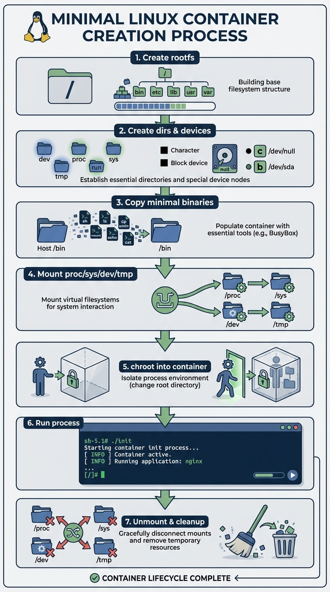

# مینی کانتینر (Mini Container)
				پروژه درس سیستم های عامل ترم 4041 - محمدرضا اورعی
<p align="center">
  
</p>

این پروژه، پروژه‌ی نهایی درس سیستم‌های عامل می‌باشد و یک **پیاده‌سازی ساده از کانتینرها** (شبیه عملکرد Docker) با استفاده از قابلیت‌های هسته‌ی لینوکس ارائه می‌دهد. هدف اصلی پروژه، بررسی و استفاده از مفاهیم کلیدی سیستم‌عامل مانند **ایزولاسیون فرایند، مدیریت منابع و امنیت فایل‌سیستم** است.
در این پروژه تلاش شده است یک **پیاده‌سازی سبک کانتینر** شبیه‌سازی شود که مفاهیم اصلی سیستم‌عامل را به صورت عملی نشان دهد. این شامل موارد زیر است:
- ایزولاسیون فرایند
- مدیریت منابع
- امنیت فایل‌سیستم
این سیستم به طور مستقیم با **مکانیزم‌های هسته‌ی لینوکس** تعامل دارد و از **فراخوانی‌های سیستمی و رابط‌های هسته** بهره می‌برد.
در ادامه، توضیحات کلی پروژه ارائه شده است. برای مشاهده‌ی **ریزجزئیات و نحوه‌ی پیاده‌سازی**، پیشنهاد می‌شود موارد زیر مطالعه شود:
	- [مستندات API](docs/api.md)
	- [گزارش فنی](docs/technical_report.md)

<div style="page-break-after: always;"></div>

# ساختار کلی ماژول ها
![[overciew-1.png]]
# ویژگی‌های کلیدی
* **ایزولاسیون فرایند**: استفاده از Linux Namespaces (PID, Mount, UTS, Network, User).
* **مدیریت منابع**: کنترل میزان مصرف CPU و RAM با استفاده از Cgroups و پیاده سازی آن توسط زبان برنامه نویسی C++.
* **امنیت فایل‌سیستم**: استفاده از `chroot` (Change Root)برای محدودسازی دسترسی به دایرکتوری ها.
* **مدیریت چرخه حیات**: قابلیت ایجاد، شروع، توقف و حذف کانتینر. (در این پروژه کانتینر ها به صورت State-Base پیاده سازی شده اند و هر کانتینتر برای Valid بودن و وجود داشتن باید در یکی از این حالت ها باشد.)

![[states.png]]
* **رابط کاربری**: دارای خط فرمان (CLI) و رابط گرافیکی ترمینالی (TUI) و نمایش در وب سرور (مانند عملکرد دستور `htop` در لینوکس) می باشد.
<div style="page-break-after: always;"></div>

# معرفی انواع ماژول های این پروژه:
## ماژول File System (RootFS)
<div style="display:flex; align-items:center; gap:16px;">
  
  <div style="direction:rtl; text-align:justify;">
این ماژول مسئول <strong>ایجاد و مدیریت یک root filesystem مینیمال برای کانتینر</strong> است. هدف اصلی آن فراهم کردن یک محیط فایل‌سیستمی ایزوله و مستقل از سیستم میزبان می‌باشد تا پردازه‌ی داخل کانتینر بتواند بدون دسترسی مستقیم به فایل‌سیستم host اجرا شود.


در این ماژول، ابتدا یک <strong>root filesystem حداقلی (rootfs)</strong> ساخته می‌شود که شامل دایرکتوری‌های ضروری و فایل‌های پایه موردنیاز برای اجرای برنامه‌ها است. سپس <strong>device fileهای حیاتی</strong> (مانند <code>/dev/null</code> و <code>/dev/tty</code>) و ساختار استاندارد فایل‌سیستم لینوکس ایجاد می‌شوند.

<br><br>

در ادامه، <strong>باینری‌ها و فایل‌های حیاتی</strong> موردنیاز (مانند <code>/bin/sh</code> و کتابخانه‌های وابسته) از سیستم میزبان به داخل rootfs کپی می‌شوند تا امکان اجرای دستورات پایه در محیط کانتینر فراهم گردد.
  </div>
</div>

پس از آماده‌سازی ساختار فایل‌ها، فایل‌سیستم‌های مجازی و سیستمی شامل:

- `proc`
- `sysfs`
- `tmpfs`
- `devtmpfs`

در مسیرهای متناظر داخل rootfs **mount** می‌شوند تا پردازه‌ی داخل کانتینر بتواند به اطلاعات processها، دستگاه‌ها و منابع سیستم دسترسی کنترل‌شده داشته باشد.

در مرحله‌ی بعد، با استفاده از فراخوانی سیستمی **`chroot`**، پردازه وارد محیط root filesystem جدید می‌شود و اجرای برنامه‌ها در این فضای ایزوله آغاز می‌گردد.

در پایان چرخه‌ی عمر کانتینر، این ماژول مسئول **Unmount کردن تمام filesystemهای mount شده** و **پاک‌سازی کامل محیط rootfs** است تا از نشت منابع سیستم و باقی ماندن mountهای اضافی جلوگیری شود.

به طور خلاصه، این ماژول نقش **Filesystem Layer** را در معماری کانتینر ایفا می‌کند و از نظر مفهومی معادل لایه‌ی filesystem در Docker می‌باشد که ایزولاسیون فایل‌سیستمی کانتینر را فراهم می‌سازد.

<div style="page-break-after: always;"></div>

## ماژول Namespace
![[runtime-overview.png]]
این ماژول مسئول **ایجاد و مدیریت namespaceهای لینوکس برای کانتینر** است و وظیفه‌ی اصلی آن **ایزوله‌سازی پردازه‌ی کانتینری از سیستم میزبان** در سطوح مختلف سیستم‌عامل می‌باشد. با استفاده از مکانیزم‌های low‑level لینوکس مانند `clone` و `setns`، این ماژول محیط اجرایی مستقلی برای کانتینر فراهم می‌کند.

در این ماژول، یک پردازه‌ی جدید با استفاده از فراخوانی سیستمی **`clone`** ایجاد می‌شود. هنگام ساخت این پردازه، مجموعه‌ای از namespaceها (مانند `PID`, `Mount`, `UTS`, `IPC` و در صورت نیاز `Network`) فعال می‌گردند تا پردازه‌ی داخل کانتینر دید محدود و مستقلی نسبت به منابع سیستم داشته باشد.

پس از ایجاد پردازه، این ماژول وظیفه‌ی **راه‌اندازی و پیکربندی namespaceها** را بر عهده دارد. به‌عنوان مثال، در Mount Namespace، تنظیمات مربوط به mount propagation انجام می‌شود تا mountهای کانتینر به سیستم میزبان نشت نکنند و بالعکس. این مرحله پایه‌ی ایزولاسیون فایل‌سیستمی کانتینر را تشکیل می‌دهد.

ماژول Namespace همچنین امکان **پیوستن به namespace یک پردازه‌ی موجود** را از طریق تابعی مبتنی بر `setns` فراهم می‌کند. این قابلیت برای سناریوهایی مانند اجرای دستور داخل یک کانتینر فعال (مشابه `docker exec`) یا دیباگ کردن محیط کانتینری کاربرد دارد.

علاوه بر این، این ماژول قابلیت **یکپارچه‌سازی با cgroup** را نیز دارد؛ به‌طوری‌که پس از ایجاد پردازه‌ی کانتینری، می‌توان آن را به یک cgroup مشخص اضافه کرد تا محدودیت‌هایی مانند مصرف CPU و حافظه اعمال شود.

به طور خلاصه، این ماژول نقش **Isolation Layer** را در معماری کانتینر ایفا می‌کند و مسئول جداسازی پردازه‌ی کانتینر از سیستم میزبان در سطح process، mount و سایر منابع هسته است. از نظر مفهومی، این بخش معادل استفاده‌ی Docker از Linux namespaces برای ایجاد محیط‌های کانتینری ایزوله می‌باشد.

<div style="page-break-after: always;"></div>

## ماژول Resource Manager (Cgroup)
![[rescource.png]]
این ماژول مسئول **مدیریت و محدودسازی منابع سیستم برای کانتینر** با استفاده از **Linux cgroups** است. هدف اصلی آن کنترل مصرف منابعی مانند **CPU و حافظه** توسط پردازه‌ی کانتینری و جلوگیری از تأثیرگذاری آن بر سایر پردازه‌های سیستم میزبان می‌باشد.

در این ماژول، ابتدا **نسخه‌ی cgroup سیستم (v1 یا v2)** به‌صورت خودکار شناسایی می‌شود تا پیاده‌سازی بتواند با پیکربندی‌های مختلف کرنل لینوکس سازگار باشد. بر اساس نسخه‌ی تشخیص داده‌شده، مسیرها و فایل‌های کنترلی مناسب برای اعمال محدودیت‌ها انتخاب می‌شوند.
پس از شناسایی نسخه، برای هر کانتینر یک **cgroup اختصاصی** ایجاد می‌شود. این cgroup به‌صورت مجزا برای کنترلرهای CPU و Memory (و در cgroup v1 به‌صورت زیرسیستم‌های جداگانه) ساخته شده و آماده‌ی اعمال سیاست‌های محدودسازی می‌گردد.

در ادامه، این ماژول امکان **اعمال محدودیت‌های CPU** (مانند `quota`, `period` و `shares`) و **محدودیت‌های حافظه** (مانند `memory limit` و `swap limit`) را فراهم می‌کند. این محدودیت‌ها با نوشتن مستقیم در فایل‌های کنترلی cgroup اعمال می‌شوند و باعث می‌شوند مصرف منابع کانتینر از مقادیر تعیین‌شده فراتر نرود. پس از ایجاد پردازه‌ی کانتینری، ماژول Resource Manager وظیفه‌ی **افزودن پردازه و تمام threadهای آن به cgroup مربوطه** را بر عهده دارد. این کار تضمین می‌کند که تمام execution contextهای کانتینر تحت محدودیت‌های تعریف‌شده قرار بگیرند. این مرحله معمولاً از طریق یک callback و بلافاصله پس از ایجاد process انجام می‌شود.

علاوه بر اعمال محدودیت‌ها، این ماژول قابلیت **جمع‌آوری آمار مصرف منابع** را نیز فراهم می‌کند. اطلاعاتی مانند:
- میزان مصرف CPU
- میزان حافظه‌ی استفاده‌شده
از فایل‌های آماری cgroup خوانده شده و برای مانیتورینگ یا مدیریت چرخه‌ی عمر کانتینر استفاده می‌شوند.

در پایان، پس از خاتمه‌ی اجرای کانتینر، این ماژول مسئول **حذف cgroupهای ایجادشده و پاک‌سازی منابع** است تا از باقی ماندن تنظیمات و مصرف منابع غیرضروری در سیستم جلوگیری شود.

به طور خلاصه، این ماژول نقش **Resource Control Layer** را در معماری کانتینر ایفا می‌کند و از نظر مفهومی معادل استفاده‌ی Docker از **cgroups** برای اعمال محدودیت و مانیتورینگ منابع کانتینرها می‌باشد.
<div style="page-break-after: always;"></div>
# پیش‌نیازها برای اجرا
* **هسته لینوکس**: نسخه ۳.۸ یا بالاتر.
* **کامپایلر**: GCC (g++) با پشتیبانی از C++11.
* **دسترسی**: اجرای دستورات با سطح دسترسی `root` یا `sudo`.
* **تقسیم منابع با Cgroups**: باید در مسیر `/sys/fs/cgroup` مونت شده باشد.

# نصب و راه‌اندازی

کامپایل پروژه:
```bash
git clone https://github.com/mroraie/mini-container.git
cd mini-container
make clean
make
./mini-container
```

# نحوه استفاده

### 1) رابط گرافیکی ترمینال

برای تجربه بصری مدیریت کانتینرها:

```bash
./mini-container-ui

```
### 2) دستورات خط فرمان (CLI)
* **اجرای یک دستور ساده در کانتینر:** اجرای این دستور ساده مصرف cpu و ram بسیار کمی دارد و اصلا مشخص نمی کند که سیستم در چه وضعیتی هست، اجرای این دستور جهت بررسی صحیح بودن نصب پروژه می باشد.
`./mini-container run /bin/echo "Hello World"`
* **اجرا با محدودیت منابع:**
`./mini-container run --memory 128 --cpu 512 /bin/sh`
در این مثال از تمام فضای حافظه ای که داریم 128 مگابایت به این برانه و این دستور اختصاص داده ایم و از کل 1024 توان پردازشی سیستم خود، 528 قسمت یعنی چیزی حدود نیمی از یک هسته کامل را برای اجرای این برنامه اختصاص داده ایم.
* **مشاهده وضعیت:**
`./mini-container list`
`./mini-container info <container_id>`
با زدن این دستورات در ترمینال می توان وضعیت هر کانتینر و اطلاعات مربوط به تمام کانتینر ها را مشاهده کرد.
* **توقف و حذف:**
`./mini-container stop <container_id>`
`./mini-container destroy <container_id>`

### 3) نمایش در وب سرور


<div style="page-break-after: always;"></div>

# جمع بندی نهایی پروژه
### ۱. Linux Namespaces
این تکنولوژی باعث می‌شود فرایند داخل کانتینر فکر کند سیستم کاملاً متعلق به خودش می باشد و کانتینر دیگری در حال اجرا نمی باشد:
* **PID**: فرایندها فقط خودشان را می‌بینند.
* **Mount**: فایل‌سیستم ایزوله.
* **UTS**: نام میزبان (Hostname) جداگانه.
* **Network**: کارت شبکه مجازی مستقل.

### ۲. Control Groups (Cgroups)
برای جلوگیری از مصرف تمام منابع سیستم توسط یک کانتینر:

* **CPU**: تعیین سهمیه پردازش.
* **Memory**: تعیین سقف مصرف رم و Swap.

### ۳. فراخوانی‌های سیستمی (System Calls)
* `clone()`: برای ایجاد فرایند جدید با فضاهای نام مشخص.
* `unshare()`: برای جدا کردن بخش‌های مشترک فرایند.
* `mount()` و `chroot()`: برای ایزولاسیون دایرکتوری‌ها.


# مقایسه مینی کانتینر با داکر (Docker)
برای ساخت این پروژه از داکر الهام گرفته شده است و در طراحی و پیاده سازی سعی شده است که مفاهیم اولیه ای از داکر در این پروژه استفاده شود:

| ویژگی | مینی کانتینر | Docker |
| --- | --- | --- |
| **ایزولاسیون** | فضای نام هسته (Namespace) | فضای نام + لایه‌های امنیتی اضافی |
| **مدیریت منابع** | cgroups ساده | cgroups پیشرفته + سهمیه‌بندی دقیق |
| **فایل‌سیستم** | chroot ساده | سیستم لایه‌ای (OverlayFS) |
| **شبکه** | فضای نام پایه | پل‌های مجازی (Bridge) و شبکه پیچیده |
| **پیچیدگی** | بسیار کم (آموزشی) | بالا (صنعتی) |

<div style="page-break-after: always;"></div>

# تست‌های عملکرد

برای اطمینان از ایزولاسیون، می‌توانید تست‌های زیر را داخل کانتینر اجرا کنید:

* **تست فشار CPU:**
این دستور بدون هیچ محدودیت ای کل توان cpu را برای خودش در نظر می گیرد و امکان کرش شدن سرور در این حالت وجود دارد:
```
./mini-container run sh -c 'while true; do :; done'
```

```
taskset -c 1 sh -c 'while true; do :; done'
```
اما این دستور کل توان را به cpu نمی دهد بلکه فقط 1/4 توان یک هسته را در اختیار اجرای این برنامه قرار می دهد:
```
./mini-container run --cpu 256 sh -c 'while true; do :; done'

```
بعضی دستورات پیشرفته تر برای تست عملکرد cpu: 

```
./mini-container run --cpu 512 sh -c 'while true; do echo $((12345*67890)) > /dev/null; done'
```


* **تست محدودیت حافظه:**
`dd if=/dev/zero of=/tmp/mem bs=1M count=80`


دستور برای اختصاص دادن 256 مگ از فضای حافظه:
```
./mini-container run --memory 300 sh -c '
x="";
for i in $(seq 1 256); do
  x="$x$(head -c 1M /dev/zero)";
  sleep 0.12;
done;
sleep infinity
'
```


sh -c 'a=(); while true; do a+=("$(head -c 10M /dev/zero)"); sleep 0.1; done'


دستور برای گرفتن تمام فضای حافظه رم (در این تست 2 گیگ می باشد.)، اما محدود به 1 گیگ و کرش کردن دستور در انتهای آن برای جلو گیری از مصرف تمام فضای مموری: 


```
./mini-container run --memory 1024 sh -c '
x="";
for i in $(seq 1 2048); do
  x="$x$(head -c 1M /dev/zero)";
  sleep 0.0147;
done;
sleep infinity
'
```


* دستوراات ترکیبی رم و مموری (این دستور یک **تست ترکیبی CPU و RAM** هست و می‌شه گفت “stress test” کانتینره) :
* 
```
./mini-container run --memory 200 --cpu 256 sh -c 'a=""; while true; do a="$a$(printf %0100000d 0)"; done'
```

<div style="page-break-after: always;"></div>

# فضای اجرا

اجرای ساده ترین تست cpu:
![[run1.png]]

مشاهده مصرف منابع: 
![[run2.png]]


اضافه کردن یک کانتینر دیگر به برنامه
![[run3.png]]

مشاهده مصرف منابع: 
![[run4.png]]


