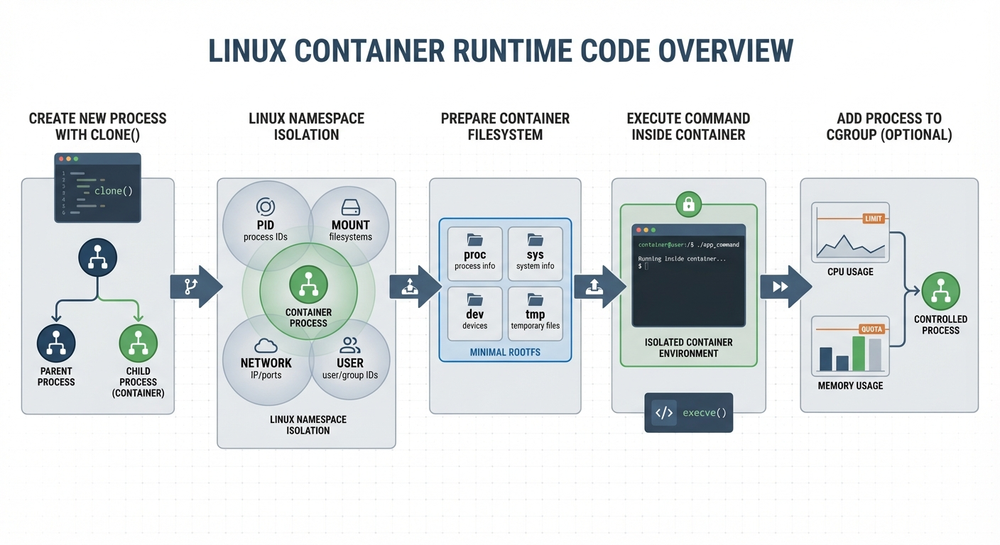
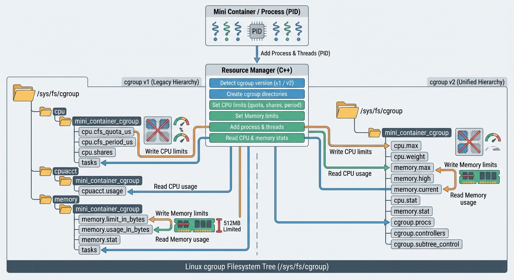

# Mini Container
Operating Systems Course Project - Term 4041 - Mohammadreza Oraie

<p align="center">
  
</p>

This project is the final assignment for the Operating Systems course, providing a **simple implementation of containers** (similar to Docker) using Linux kernel features. The primary goal is to explore and utilize key OS concepts such as **process isolation, resource management, and filesystem security**.

This **lightweight container implementation** demonstrates core OS concepts in practice, including:
- Process isolation
- Resource management
- Filesystem security

The system interacts directly with **Linux kernel mechanisms**, leveraging **system calls and kernel interfaces**.

For detailed implementation specifics, please refer to:
- [API Documentation](docs/api.md)
- [Technical Report](docs/technical_report.md)
- [GitHub Repository](https://github.com/mroraie/mini-container)

---

# Module Architecture


# Key Features
* **Process Isolation**: Utilizes Linux Namespaces (PID, Mount, UTS, Network, User).
* **Resource Management**: Controls CPU and RAM usage via Cgroups, implemented in C++.
* **Filesystem Security**: Uses `chroot` (Change Root) or `pivot_root` to restrict directory access.
* **Lifecycle Management**: Supports creating, starting, stopping, and destroying containers. (Implemented as a state-based system).


* **User Interface**: Includes a Command Line Interface (CLI) and a Terminal User Interface (TUI) via a web server (similar to `htop` functionality).

---

# Module Overview

## Filesystem Module (RootFS)
<div style="display:flex; align-items:center; gap:16px;">
  
  <div style="text-align:justify;">
This module is responsible for <strong>creating and managing a minimal root filesystem for the container</strong>. Its main goal is to provide an isolated filesystem environment independent of the host system, ensuring the process inside the container runs without direct access to the host filesystem.
<br><br>
It constructs a <strong>minimal root filesystem (rootfs)</strong> containing essential directories and base files. Critical <strong>device files</strong> (like <code>/dev/null</code> and <code>/dev/tty</code>) are created along with the standard Linux filesystem structure.
<br><br>
<strong>Essential binaries and libraries</strong> (such as <code>/bin/sh</code>) are copied from the host to the rootfs to enable basic command execution within the container.
  </div>
</div>

Virtual and system filesystems including:
- `proc`
- `sysfs`
- `tmpfs`
- `devtmpfs`

are **mounted** at their respective paths within the rootfs. Using the **<code>chroot</code>** system call, the process enters the new root filesystem, and execution begins in this isolated space.

At the end of the container lifecycle, this module **unmounts all filesystems** and **cleans up the rootfs environment** to prevent resource leaks.

## Namespace Module

This module manages **Linux Namespaces**, isolating the container process from the host system at various levels. Using low-level calls like `clone` and `setns`, it provides an independent execution environment.

A new process is created using **<code>clone</code>**, activating namespaces such as `PID`, `Mount`, `UTS`, `IPC`, and optionally `Network`. This ensures the container has a restricted and independent view of system resources.

It also handles **namespace configuration**, such as mount propagation settings. The module allows **joining existing namespaces** (similar to `docker exec`) for debugging or executing commands in active containers.

## Resource Manager Module (Cgroup)

This module manages system resources using **Linux Cgroups**. It controls **CPU and Memory** consumption, preventing a single container from impacting the host or other processes.

It automatically detects the **Cgroup version (v1 or v2)** and applies appropriate control paths. Each container gets a **dedicated Cgroup** for CPU and Memory controllers.

It supports **CPU limits** (`quota`, `period`, `shares`) and **Memory limits** (`limit`, `swap limit`). These are applied by writing directly to Cgroup control files. It also **collects usage statistics** for monitoring.

---

# Prerequisites
* **Linux Kernel**: Version 3.8 or higher.
* **Compiler**: GCC (g++) with C++11 support.
* **Privileges**: Root or `sudo` access required for container operations.
* **Cgroups**: Must be mounted at `/sys/fs/cgroup`.

# Installation

Compile the project:
```bash
git clone https://github.com/mroraie/mini-container.git
cd mini-container
make clean
make
```

# Usage

### 1) Terminal GUI (Web Monitor)
Run the web server to monitor containers via a browser:
```bash
./mini-container-web
```

### 2) CLI Commands
* **Run a simple command:**
  `./mini-container run /bin/echo "Hello World"`
* **Run with resource limits:**
  `./mini-container run --memory 128 --cpu 512 /bin/sh`
  *(Allocates 128MB RAM and 512 CPU shares (~half a core)).*
* **List containers:**
  `./mini-container list`
* **Container info:**
  `./mini-container info <container_id>`
* **Stop and Destroy:**
  `./mini-container stop <container_id>`
  `./mini-container destroy <container_id>`

---

# Summary of Concepts

### 1. Linux Namespaces
Makes the process believe it is the only one on the system:
* **PID**: Isolated process tree.
* **Mount**: Isolated filesystem mount points.
* **UTS**: Independent hostname.
* **Network**: Independent network stack.

### 2. Control Groups (Cgroups)
Prevents resource exhaustion:
* **CPU**: Processing time allocation.
* **Memory**: RAM and Swap limits.

### 3. System Calls
* `clone()`: Create process with specific namespaces.
* `unshare()`: Disassociate parts of the process context.
* `mount()` & `chroot()`: Directory isolation.

---

# Comparison: Mini Container vs Docker

| Feature | Mini Container | Docker |
| --- | --- | --- |
| **Isolation** | Kernel Namespaces | Namespaces + Extra Security Layers |
| **Resource Mgmt** | Basic Cgroups | Advanced Cgroups + Quotas |
| **Filesystem** | Simple chroot/pivot_root | Layered System (OverlayFS) |
| **Networking** | Basic Namespace | Complex Virtual Bridges |
| **Complexity** | Low (Educational) | High (Production Grade) |

---

# Performance Tests

To verify isolation, run these tests inside a container:

* **CPU Stress Test:**
```bash
# Unlimited (Caution: might crash host)
./mini-container run sh -c 'while true; do :; done'

# Limited to 1/4 of a core
./mini-container run --cpu 256 sh -c 'while true; do :; done'
```

* **Memory Limit Test:**
```bash
# Allocate 256MB gradually in a 300MB limit container
./mini-container run --memory 300 sh -c 'x=""; for i in $(seq 1 256); do x="$x$(head -c 1M /dev/zero)"; sleep 0.12; done; sleep infinity'
```

* **Combined Stress Test:**
```bash
./mini-container run --memory 200 --cpu 256 sh -c 'a=""; while true; do a="$a$(printf %0100000d 0)"; done'
```
